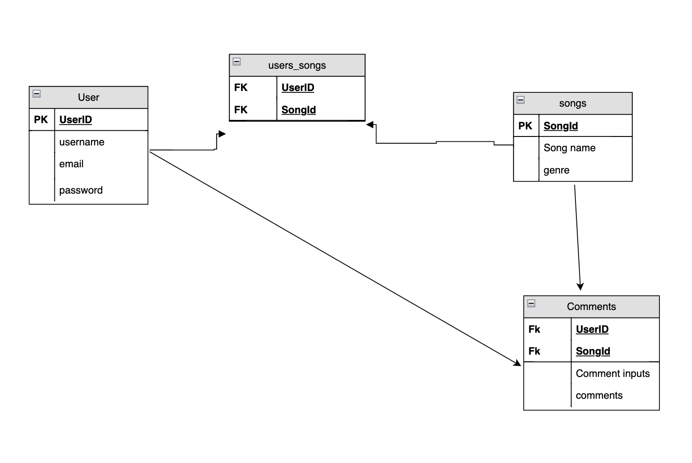

## dotify

### Pitch

dotify is a music app that allows users to favorite songs and add them to their liked songs playlist. The app also allows users to add comments to the songs so other users can see what you have to say and possibly have the actual artist see your comment and reply. 

### Tech being used

* Node 
* express
* sql
* (https://itunes.apple.com/us/rss/topsongs/limit=100/json/)

### ERD

### RestFul Routing chart

### Wireframe

### User Story 

* As a user, I would live to be able to see a list full of songs 
* As a user, I would like to be able to add songs I like to my favorites playlist. 
* As a user, I would like to be able to click a song and see info about and see comments other users have made.

### MVP 

* Be able to display Songs
* Be able to like songs
* Be able to comment
* Functional comment section
* Make routes work perfectly
* Make app look nice
* Able to remove songs from favorites

### Strech Goals

* Be able to like other peoples comments
* Be able to reply to other peoples comments
* Be able to erase comments
* Be able to play song potentially
* Make different playlist
* Button that you click to show artist or songs in the same genre
* Button that creates a link thats has all your name and favorited songs so you can share with friends
* Add fake memberships page
