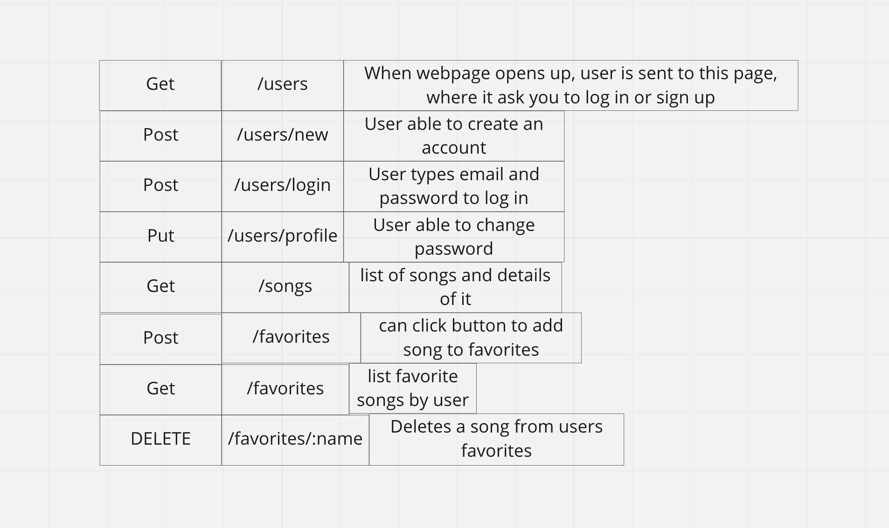

# dotify

### Link to Website

(https://deploy-dotify.herokuapp.com/)
Demo Account: email: a@s password: as

### Pitch

dotify is a knockoff version of another popular music app that I can't name for legal reasons. When you make an account and log into dotify, you will get a list of the most up to date top 100 songs from all genres. As a user, you will be able to see details of each song(Song name, Artist, Genre, Price) and be able to favorite any song and add/remove songs on your favorites playlist. Unfortunetly, the app doesn't support previews at this time so best way to hear the song is Youtube.

### Tech being used

* API used (https://itunes.apple.com/us/rss/topsongs/limit=100/json/)
* HTML, CSS - For Styling
* JavaScript - For Node and Express 
* PostgresQL - For Database used to store data
* Sequelize - Allows js to interact with database
* Bootstrap - CSS framework for styling
* UI Elements (https://uiverse.io/)

### Installation Instruction
- Fork and clone this repository to your local directory
- Navigate to the directory in your terminal and run npm i to install dependencies
- Run touch .env and type in the following code in the .env file: ENC_SECRET='secret'
- Replace 'secret' with any string you like if necessary
- Setup your database (this app has 3 active models) and create it
- After creating,ru n sequelize db:migrate to run migrations
- Use npx nodemon (or just nodemon if you installed it globally) to start your application
- Go to http://localhost:8080/ in browser to see what you've made

### ERD

### RestFul Routing chart

### Wireframe

### User Story 

* As a user, I would like to be able to update my password
* As a user, I would like to be able to see a list full of songs.
* As a user, I would like to be able to add songs I like to my favorites playlist. 

### MVP 

* Be able to display Songs from API
* Be able to favorite songs
* Make routes work perfectly
* Make app look as nice as possible with bootstrap
* Able to remove songs from favorites

### Strech Goals

* Having a comments section specifically for a song
* Be able to like other peoples comments
* Be able to reply to other peoples comments
* Be able to erase comments if user who made it is logged in
* Be able to play song potentially
* Make different playlists
* Button that you click to show artist or songs in the same genre
* Button that creates a link thats has all your name and favorited songs so you can share with friends
* Add fake memberships page

### Post reflection 

The amount of stress and confusion going into this project has been a rollercoaster. Going into this project I wasn't very comfortable with what we've learned this unit(FullStack) and was blessed we had a week break which was very needed for me. During the week break, I tried to organize my time and review all the lessons I didn't fully understand and it helped a lot. I had a much better understanding of routes and what the purpose of the folders/files we made have. Of course doing the project, I had many bugs and was very lucky to have amazing classmates to help me with fixing them and being able to answer questions with parts I was confused at. Finishing the project, I think I have a much better understanding of what's going on, of course stil need to practice a lot of best practices but, feel much better in doing another FullStack project. 
